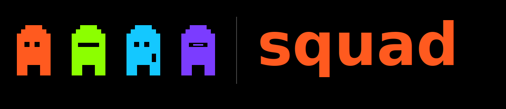

<p align="center">
  <a href="https://github.com/CowDogMoo/squad">
    
  </a>
</p>

<p align="center">
  <strong>Fabric for AI agents.</strong><br>
  Build, share, and run AI agents from the command line.
</p>

<p align="center">
  <a href="https://github.com/CowDogMoo/squad/blob/main/LICENSE"></a>
  <a href="https://go.dev/"></a>
  <a href="https://github.com/CowDogMoo/squad/releases"></a>
  <a href="https://codecov.io/github/CowDogMoo/squad"></a>
</p>

<p align="center">
  <a href="https://github.com/CowDogMoo/squad/actions/workflows/semgrep.yaml"></a>
  <a href="https://github.com/CowDogMoo/squad/actions/workflows/pre-commit.yaml"></a>
  <a href="https://github.com/CowDogMoo/squad/actions/workflows/renovate.yaml"></a>
</p>

---

## Overview

Inspired by [Daniel Miessler's Fabric](https://github.com/danielmiessler/fabric).
Define an agent in markdown and YAML, point it at any LLM, and turn it
loose on a codebase.

- Works with OpenAI, Anthropic, Google AI, Ollama, NVIDIA NIM, and Databricks AI Gateway
- Agents are just files: markdown prompts + YAML manifest, checked into git
- Built-in tools: Read, Write, Edit, Glob, Grep, Bash, plus any MCP server
- Multi-agent pipelines with dependency ordering, parallel stages, and regression gates
- Runs locally, in Docker, on Kubernetes, or over AWS SSM

**Built for:**

- Security teams running code review, audits, and recon
- Platform engineers enforcing standards across repos
- Developers building review and refactoring workflows

## Prerequisites

| Requirement    | Version | Notes                         |
| -------------- | ------- | ----------------------------- |
| **Go**         | 1.24+   | Required for `go install`     |
| **LLM access** | -      | OpenAI, Anthropic, Google AI, or Ollama |

## Quick Start

```bash
# Install
go install github.com/cowdogmoo/squad/cmd/squad@latest

# Add the official agents repository
squad agents add official https://github.com/cowdogmoo/squad-agents.git

# List available agents
squad agents list

# Run an agent against your codebase
squad run --agent go-review --provider openai --model gpt-4.1-mini

# Run with local Ollama
squad run --agent go-review --provider ollama --model qwen2.5-coder:7b-instruct

# Run a composed (multi-agent) pipeline
squad run --agent security-audit "Review this codebase"

# Resume a prior run after a crash, ctrl-c, or budget stop
squad run --agent go-review --resume 20260429T150220Z-a1b2c3d4 \
    "continue where you left off; finish the remaining files"
```

### Sessions

Every run writes an append-only event log to
`./.squad/sessions/<id>/`:

| File                   | Contents                                              |
| ---------------------- | ----------------------------------------------------- |
| `meta.json`            | run options, last response id, cost, status          |
| `events.jsonl`         | one line per prompt, response, tool call, tool result |
| `results/<id>.txt`     | full bytes of any tool result that exceeded 8 KiB     |

`--resume <id>` reopens that session and chains the next request to the
prior OpenAI Responses API id, so the model picks up server-side state
without re-sending the transcript. When a tool result is too large to
inline, the model sees a `[result:<id> — N bytes elided …]` placeholder
and can fetch the full bytes (or any byte range) via the
`get_tool_result` tool.

## Documentation

### Getting Started

- **[Configuration](docs/configuration.md)** - Providers, environment variables,
  and config file reference
- **[Creating Agents](docs/creating-agents.md)** - Build your own agents from
  scratch or from templates
- **[Prompt Engineering Basics](docs/prompt-engineering-basics.md)** - LLM
  fundamentals, context windows, and how to write effective agent prompts

### Guides

- **[Pipelines](docs/pipelines.md)** - Multi-agent orchestration with stages,
  gates, and cost budgets
- **[Execution Backends](docs/execution-backends.md)** - Run agents in Docker,
  Kubernetes, or AWS SSM
- **[MCP Servers](docs/mcp-servers.md)** - Connect agents to external tools
  via Model Context Protocol
- **[Observability](docs/observability.md)** - Streaming output, OpenTelemetry
  tracing, cost budgeting, and grading

### Agents

- **[Official Agents](https://github.com/CowDogMoo/squad-agents)** - Production-ready
  agents for Go, Python, Ansible, and Molecule
- **[Agent Quality Guide](docs/agent-quality.md)** - Tuning methodology and
  grading rubric

## Features

### Core Capabilities

| Feature                     | Description                                        |
| --------------------------- | -------------------------------------------------- |
| **Agent Execution**         | Run agents with Read, Write, Edit, Glob, Grep, Bash |
| **Multi-provider**          | OpenAI, Anthropic, Google AI, Ollama, NVIDIA NIM, Databricks AI Gateway |
| **Streaming Output**        | Real-time token streaming to stderr                |
| **Fix + Analyze Modes**     | Agents can apply fixes or report-only              |
| **Agent Scaffolding**       | `squad init agent` from templates or existing agents |
| **Agent Repositories**      | Git-based agent sharing and discovery              |

### Orchestration

| Feature                     | Description                                        |
| --------------------------- | -------------------------------------------------- |
| **Declarative Pipelines**   | Multi-stage YAML pipelines with dependency ordering |
| **Parallel Execution**      | Multiple agents in a stage run concurrently        |
| **Regression Gates**        | Shell commands validate state between stages       |
| **Background Tasks**        | Spawn child agents with `Task(background=true)`    |
| **Cost Budgeting**          | `--max-cost` limits total spend across agents      |

### Infrastructure

| Feature                     | Description                                        |
| --------------------------- | -------------------------------------------------- |
| **Execution Backends**      | Local, Docker, Kubernetes, AWS SSM                 |
| **MCP Integration**         | Connect to any Model Context Protocol server       |
| **OpenTelemetry**           | OTLP tracing for agent runs and tool calls         |
| **Agent Grading**           | Grade outputs against quality rubrics              |
| **XDG Configuration**       | Standard config paths with env var overrides       |

## Built With

- [LangChainGo](https://github.com/tmc/langchaingo)
- [Cobra](https://github.com/spf13/cobra)
- [Viper](https://github.com/spf13/viper)
