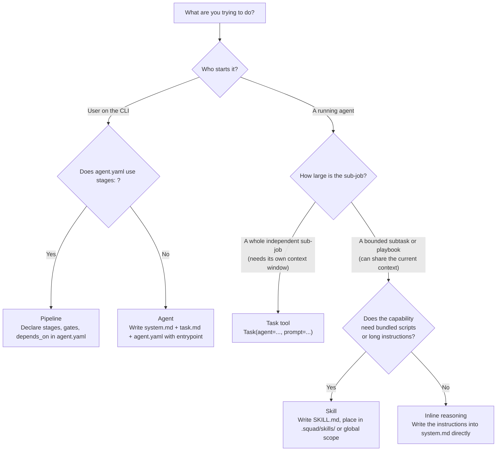
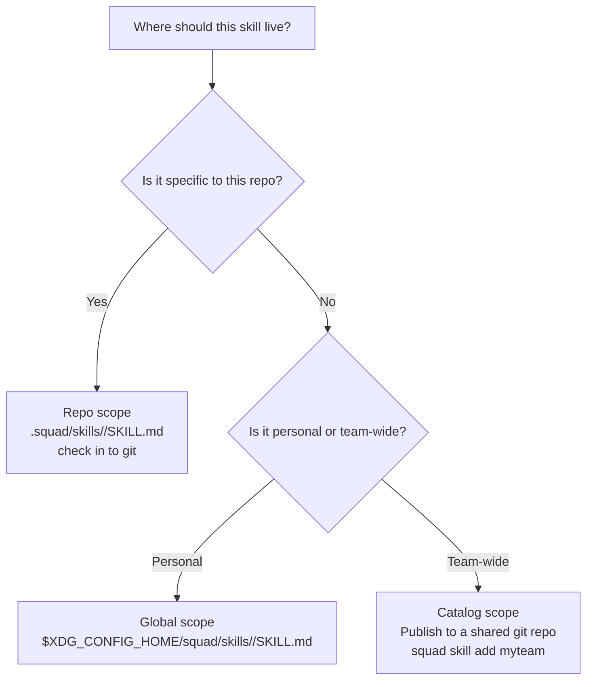

# Agent and Skill Concepts in Squad

A reference guide for Squad practitioners. Covers how Squad defines agents, skills, the Task tool, and pipelines: when to reach for each, how they relate, and decision heuristics grounded in Squad's actual design and Anthropic's published taxonomy.

For the canonical reference on writing agent prompts, see [`creating-agents.md`](./creating-agents.md). For pipeline engineering depth, see [`agents-engineering-pipeline-basics.md`](./agents-engineering-pipeline-basics.md). This document covers the taxonomy layer above both.

---

## Anthropic's baseline taxonomy

Anchoring on Anthropic's own published definitions helps before mapping Squad's concepts. Squad's naming overlaps but is not identical.

Anthropic draws one foundational distinction in [Building Effective Agents](https://www.anthropic.com/research/building-effective-agents):

| Anthropic term | Definition | Squad equivalent |
|---|---|---|
| **Workflow** | LLMs and tools orchestrated through predefined code paths | Pipeline (stages declared in `agent.yaml`) |
| **Agent** | System where the LLM dynamically directs its own processes and tool usage | A running agent deciding when to call `Task` or `Skill` |
| **Augmented LLM** | Single model call enhanced with retrieval, tools, and memory | A leaf agent using Read/Write/Bash |

Anthropic also places these on a complexity spectrum: augmented LLM → workflow patterns → autonomous agents. Squad's Pipeline sits at the workflow end; a single leaf agent using Task and Skill at runtime sits toward the autonomous end.

> **Note:** What Squad calls an "agent" (a named unit invoked with `--agent`) includes both workflows (pipeline manifests) and agents (leaf agents that reason dynamically). The distinction matters when communicating with practitioners who've read Anthropic's docs. Clarify that "agent" in Squad is a deployment unit, not a claim about autonomy level.

---

## The four-concept model

Squad has four distinct concepts for composing AI work, each with a different scope, trigger mechanism, and authoring surface.

| Concept | Triggered by | Lifetime | Authoring surface |
|---|---|---|---|
| **Agent** | User (`squad run --agent`) | The whole run | `agent.yaml` + `system.md` + `task.md` |
| **Skill** | A running agent (`Skill(name)`) | A subtask within a run | `SKILL.md` in a skill directory |
| **Task tool** | A running agent (`Task(agent=..., prompt=...)`) | An independent child run | The referenced agent's own files |
| **Pipeline** | User (`squad run --agent`) on a composed manifest | Multiple runs coordinated as stages | `agent.yaml` with `stages:` block |

The choice comes down to **who triggers it**, **when**, and **what it produces** (not raw capability).

---

## Agents

An agent is the top-level unit of work in Squad. It is always invoked explicitly by the user on the CLI and runs for the duration of the request.

```bash
squad run --agent go-review --provider anthropic --model claude-sonnet-4-6
```

### Structure

```
go-review/
├── agent.yaml      # manifest: name, entrypoint, wrapper, task, models, budget
├── system.md       # identity, hard rules, workflow
├── agent.md        # execution wrapper
├── task.md         # default task instructions
└── references/     # optional knowledge-base documents
    └── criteria.md
```

### Modes

Every agent can run in two modes, controlled at invocation time:

```bash
squad run --agent go-review                    # default: edit mode
squad run --agent go-review --mode readonly    # report only, no file writes
```

Prompt conditionals gate mode-specific behaviour inside `system.md`:

```markdown
{{if eq .Mode "edit"}}
You are an autonomous code reviewer. Fix issues and verify compilation.
{{end}}
{{if eq .Mode "readonly"}}
You are an analysis agent. Report issues. Do NOT modify any files.
{{end}}
```

Mode is a cross-cutting dimension. It applies to every agent, and also affects how skills behave when loaded inside a readonly-mode run. Write/Edit calls are blocked in readonly mode regardless of what a skill's body says.

### When an agent is the right choice

- The task is the whole job, not a piece of a larger job
- The work has a single clear output artifact
- No parallel concerns exist that would benefit from separate context windows
- The user initiates directly rather than another agent delegating

---

## Skills

A skill is an on-demand capability a running agent loads mid-task. It follows [Anthropic's open Agent Skills standard](https://platform.claude.com/docs/en/agents-and-tools/agent-skills/overview), the same format Claude Code and other compliant runtimes consume.

**Unlike agents:** skills are never invoked by the user. The agent reads the description in its system prompt, decides the current task matches, and calls `Skill(name)` itself.

### Structure

```
grocery-add-to-cart/
├── SKILL.md        # required: YAML frontmatter + markdown body
├── references/     # optional: long-form docs, schemas
├── scripts/        # optional: executable helpers the skill invokes
└── assets/         # optional: templates, fixtures
```

`SKILL.md` format:

```yaml
---
name: grocery-add-to-cart
description: |
  Add weekly groceries from the planner doc to the Amazon Whole Foods
  cart. Stops at the cart. Never checks out. Use this when the user
  asks for "groceries this week" or references the planner doc.
---

# Grocery Add To Cart

## When to use this skill
...

## Steps
...
```

> **Description field guidance (from Anthropic's spec):** The `description` should say both *what* the skill does and *when* to use it. This is the only information the agent has at boot. If it's ambiguous about trigger conditions, the agent will either miss the skill or call it for the wrong task. Write it as: "Do X when the user asks about Y or mentions Z."

Only `name` and `description` are injected into the agent's system prompt at boot. The full body loads lazily when the agent calls `Skill(name)`. This is **level-2 progressive disclosure**: keep the context window small at start; expand only what the current task needs.

### Three-tier loading and token costs

Anthropic's Agent Skills spec defines three loading tiers. Squad implements the same model:

| Level | Loaded when | Token cost | Contents |
|---|---|---|---|
| **1: Metadata** | Always, at agent boot | ~100 tokens per skill | `name` + `description` from YAML frontmatter |
| **2: Instructions** | When agent calls `Skill(name)` | Up to ~5 k tokens | Full SKILL.md body |
| **3: Resources** | When agent reads bundled files | Effectively unlimited | Scripts, references, assets (only what the agent accesses) |

This means you can register many skills without penalizing the context window at start. The cost of a skill that never gets triggered is ~100 tokens.

### How Squad loads skills vs. Anthropic's platform

Anthropic's hosted platform (claude.ai, API) implements skill loading via bash commands in a VM. Claude literally runs `bash: read my-skill/SKILL.md` against a filesystem. Squad implements the same *format* but uses a different *mechanism*: the `Skill(name)` tool handler in Go reads the file and injects its contents directly, without a VM or bash call. The result the agent sees is identical; the implementation path is different.

**Practical implication:** Scripts in a skill's `scripts/` directory work the same way in both environments. The agent calls `bash "$SQUAD_SKILL_DIR/scripts/my-script.sh"`. The `SQUAD_SKILL_DIR` environment variable is injected by Squad's Bash tool wrapper whenever a skill is on the stack.

### How a skill loads

1. At agent boot, Squad assembles a catalog block in the system prompt:

   ```
   ## Available skills
   - **grocery-add-to-cart**: Add weekly groceries from the planner doc...
   ```

2. The agent calls `Skill("grocery-add-to-cart")` when the task matches.
3. Squad pushes the skill directory onto the run's skill stack and returns the full SKILL.md body.
4. For the rest of the run, `Read` and `Bash` are permitted inside the skill directory. `SQUAD_SKILL_DIR` is set in Bash so bundled scripts can resolve sibling files:

   ```bash
   bash "$SQUAD_SKILL_DIR/scripts/scrape-recipe.sh"
   ```

5. `Write` and `Edit` remain anchored to the working directory. Skills are reference material, not write targets.

### Skill scopes

Three places skills can live, in precedence order. When the same `name` appears at multiple scopes, the higher-precedence one wins and lower ones are silently shadowed.

| Scope | Location | Use case |
|---|---|---|
| **repo** | `<cwd>/.squad/skills/<name>/SKILL.md` (checked into git) | Project-specific skills shared with the whole team |
| **global** | `$XDG_CONFIG_HOME/squad/skills/<name>/SKILL.md` | Personal cross-project skills |
| **catalog** | Cloned git repos in the skills cache + `cfg.Skills.LocalPaths` | Shared team libraries or vendor catalogs |

```bash
squad skill list          # skills visible to the current agent, by scope
squad skill list --all    # include shadowed entries, useful to audit collisions
```

#### Choosing the right scope

Use **repo scope** when the skill is specific to this codebase and should be version-controlled with it. The team gets the same skill from git; no per-developer setup required.

Use **global scope** when the skill is personal and applies across multiple repos (e.g., a skill for your team's preferred ticket format or a personal style guide).

Use **catalog scope** when your organization publishes a shared skills library that multiple teams pull from. Register it once:

```bash
squad skill add myteam https://github.com/example/squad-skills.git
squad skill update       # pull latest
```

### Per-agent skill control

Filter which skills an agent can see in `agent.yaml`:

```yaml
skills:
  enabled: true
  scopes: [repo, global]         # only surface repo and global; skip catalog
  allow: [grocery-add-to-cart]   # exclusive allowlist, only this skill is visible
  deny: [debug-fs]               # blocklist applied after scopes
```

Override at run time:

```bash
squad run --agent my-agent --allow-skill grocery-add-to-cart
squad run --agent my-agent --deny-skill debug-fs
squad run --agent my-agent --skills-disabled    # no skills for this run
```

### Creating a skill

```bash
squad skill new grocery-add-to-cart          # scaffolds in .squad/skills/ by default
squad skill new grocery-add-to-cart --global # scaffolds in global scope
squad skill validate .squad/skills/grocery-add-to-cart
squad skill list
```

### Anthropic pre-built skills

Anthropic publishes pre-built skills for document tasks (PowerPoint, Excel, Word, PDF) available through the Claude API and claude.ai. These use the same `SKILL.md` format and are available for reference as examples. Squad users running against an Anthropic provider would need to bundle these manually. They are not auto-injected by the provider.

Anthropic also maintains an open-source skills repository at [github.com/anthropics/skills](https://github.com/anthropics/skills). Any skill from that repo is compatible with Squad's global or catalog scope without modification.

### Data retention note

Anthropic's own platform excludes Skills from Zero Data Retention (ZDR) arrangements. Skill definitions and execution data are retained under standard policy. If your team operates under a ZDR agreement with Anthropic, be aware that any skills invoked via the API are subject to standard retention. This is an Anthropic platform constraint, not a Squad constraint.

### When a skill is the right choice

- The capability is one **piece** of a larger task, not the whole task
- Multiple different agents might benefit from the same capability
- The instructions are long enough to clutter the system prompt but not needed every run
- You want a clean audit trail of which capability the agent reached for (`skill_loaded` events in `events.jsonl`)

---

## The Task tool

`Task` is an LLM-facing tool that lets a running agent spawn a child agent run. It is a runtime delegation call made from within an agent's reasoning loop, not a pipeline.

```
# From inside the agent's context:
Task(agent="go-tests", prompt="Run tests for the files I just modified: [list]")
```

### Blocking vs background

```yaml
# Blocking: agent waits for the child to finish
Task(agent="go-tests", prompt="...", background=false)

# Background: returns immediately with a task ID
Task(agent="go-tests", prompt="...", background=true)
# Later:
TaskResult(task_id="bg-1")
```

Background tasks are capped at 4 concurrent by default and can run in parallel when the parent agent fans out multiple background calls.

### Constraints

- Maximum nesting depth: 3 (parent → child → grandchild)
- Each child inherits the parent's working directory unless `working_dir` is overridden
- Child costs roll up into the parent's metrics and count against `--max-cost`
- The child runs the full referenced agent, not a skill or a pipeline stage

### When the Task tool is the right choice

| | Skill | Task tool |
|---|---|---|
| Loads | Instructions into the current agent's context | A full independent agent run |
| Context | Shared with the parent agent | Isolated, fresh context window |
| Cost | Minimal (one tool call, no extra model turns) | Full agent run cost |
| Output | The SKILL.md body (returned to the parent) | The child agent's final response |
| Use when | You need the agent to follow a playbook | You need a separate specialist agent to do a whole sub-job |

Reach for the Task tool when:

- The sub-job is large enough that it would pollute the parent agent's context window
- The sub-job benefits from a clean, focused context of its own
- You want the sub-job's cost tracked separately
- The sub-job is naturally isolated: its output is one artifact the parent consumes

Reach for a Skill instead when:

- You want the agent to follow a set of instructions inline
- The instructions need access to the skill's bundled scripts or references
- The capability is reusable across many different parent agents

---

## Pipelines

A pipeline is a declarative multi-stage orchestration defined in `agent.yaml` using a `stages:` block. Users invoke a pipeline the same way they invoke any other agent:

```bash
squad run --agent security-audit "Audit changes since last release"
```

Squad detects that `security-audit/agent.yaml` uses `stages:` instead of `entrypoint:` and routes to the pipeline runner.

### Anatomy of a pipeline

```yaml
name: security-audit
version: v1
description: Multi-stage Go security review

stages:
  # Stage 1: single agent, no dependencies, starts immediately
  - name: review
    agent: go-review

  # Stage 2: two agents in parallel, no dependencies, also starts immediately
  - name: analysis
    agents:
      - go-review
      - go-security-audit

  # Stage 3: single agent, waits for stage 1
  - name: testing
    agent: go-tests
    depends_on: [review]
    mode: edit
    vars:
      COVERAGE_TARGET: "85"

# Gates run shell commands between stages (cheap verification before downstream spend)
gates:
  - after: review
    command: "go build ./..."
    on_failure: revert    # undo the review agent's edits if build breaks
  - after: testing
    command: "go test ./..."
    on_failure: stop
```

### Pipelines vs Task tool

Both allow one agent to trigger another agent. The difference is authoring surface and scope:

| | Task tool | Pipeline |
|---|---|---|
| Defined in | Agent's LLM reasoning loop (runtime) | `agent.yaml` stages block (design time) |
| Trigger | The parent agent decides at runtime | The pipeline topology is fixed in YAML |
| Dependency graph | Implicit, unverifiable | Explicit, validated, visible in `--dry-run` |
| Parallelism | Manual (background tasks) | Declarative (`agents:` list in a stage) |
| Gates | Not supported | Between any two stages |
| Auditability | Child appears in parent's session | Each stage produces its own artifacts |
| Best for | Runtime delegation to a specialist | Pre-designed, repeatable multi-step workflows |

Use a **pipeline** when:

- The workflow is fixed and repeatable
- You need guaranteed parallelism between independent stages
- You need regression gates between stages
- Each step produces a structured artifact the next step consumes
- Per-stage cost auditability matters

Use the **Task tool** when:

- The agent needs to dynamically decide at runtime which specialist to call
- The sub-job is not predictable at design time
- The workflow is one-off or exploratory

### Partition: auto-splitting work across files

When a stage has many files to process, `partition` spawns one agent instance per batch:

```yaml
stages:
  - name: review-files
    agent: go-review
    partition:
      by: files
      glob: "**/*.go"
      max_per_partition: 10    # each agent instance sees at most 10 files
```

This is Squad's built-in fan-out for large codebases. It is distinct from the Task tool: partition is a pipeline-level construct; the agent instances it spawns are not aware of each other.

---

## Decision guide

Use this flowchart to decide which concept to reach for. Start at the top: who initiates the work? From there, follow the branches based on scope and whether the sub-job needs its own isolated context.



### Scope heuristic for skills



---

## Quick-reference comparison

| Question | Agent | Skill | Task tool | Pipeline |
|---|---|---|---|---|
| Who invokes it? | User (`--agent` flag) | A running agent | A running agent | User (`--agent` flag on composed manifest) |
| When is it invoked? | At run start | Mid-task, on demand | Mid-task, at runtime | At run start |
| Lives where? | `agent.yaml` + `system.md` | `SKILL.md` directory | Referenced agent's files | `agent.yaml` with `stages:` |
| Loads into context? | Is the context | Yes (body injected on demand) | No (separate context window) | No (each stage has its own context) |
| Cost | Full model run | Minimal (one tool result) | Full child agent run | Sum of all stage runs |
| Parallelism | No | No | Yes (background mode) | Yes (declarative stages) |
| Gates supported? | No | No | No | Yes |
| Audit trail | `events.jsonl` | `skill_loaded` event in `events.jsonl` | Child metrics rolled up to parent | Per-stage output artifacts |
| Mode-aware? | Yes (`edit` / `readonly`) | Yes (inherits parent's mode) | Yes (child inherits or overrides) | Yes, per-stage `mode:` field |

---

## Interop with the Anthropic Agent Skills standard

Squad implements the [Anthropic open Agent Skills standard](https://platform.claude.com/docs/en/agents-and-tools/agent-skills/overview) without modification. A skill written for Claude Code works in Squad and vice versa:

- Drop it into `$XDG_CONFIG_HOME/squad/skills/` for global scope
- Drop it into `.squad/skills/` for repo scope
- Squad does not add squad-specific frontmatter fields. The `name` and `description` fields are the standard fields.

Squad intentionally does not adopt the `allowed-tools` frontmatter field that some Claude Code skills carry. Squad's per-agent tool gating handles that at a coarser level via `agent.yaml`.

---

## See also

- [`docs/creating-agents.md`](./creating-agents.md): Agent directory layout, template variables, mode conditionals
- [`docs/pipelines.md`](./pipelines.md): Composed agent manifest reference
- [`docs/agents-engineering-pipeline-basics.md`](./agents-engineering-pipeline-basics.md): When and why to use pipelines, anti-patterns, artifact handoff design
- [Anthropic: Building Effective Agents](https://www.anthropic.com/research/building-effective-agents): Anthropic's canonical agent/workflow taxonomy and complexity spectrum
- [Anthropic: Agent Skills overview](https://platform.claude.com/docs/en/agents-and-tools/agent-skills/overview): Anthropic's official Skill spec, three-tier loading details, platform constraints
- [Anthropic: Equipping agents for the real world with Agent Skills](https://www.anthropic.com/engineering/equipping-agents-for-the-real-world-with-agent-skills): Engineering blog: design rationale for progressive disclosure
- [Anthropic open-source skills repo](https://github.com/anthropics/skills): Reference skills compatible with Squad's catalog scope
