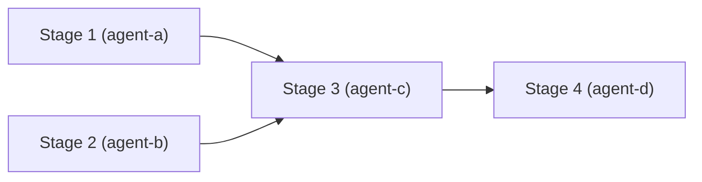
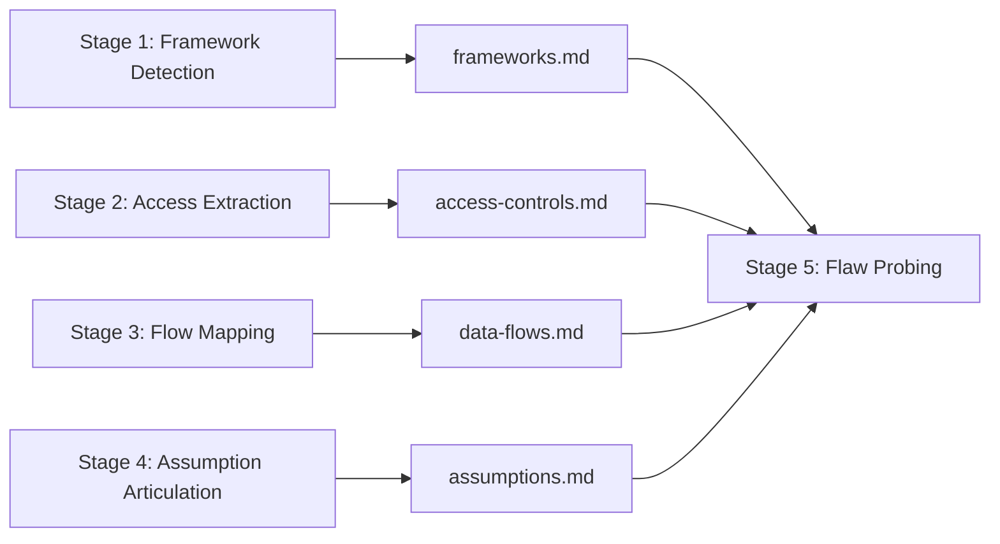
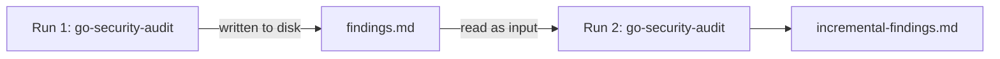
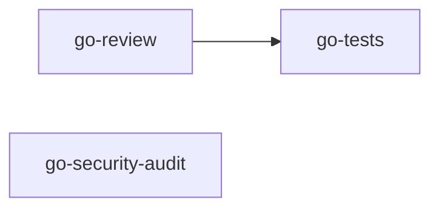

# Agent Pipeline Engineering Basics

A supplement to [pipelines.md](./pipelines.md) and [prompt-engineering-basics.md](./prompt-engineering-basics.md). Read those first, then use this to understand *why* pipelines are structured the way they are and how to design them well.

---

## Why Multiple Agents Instead of One?

The instinct when building an AI workflow is to write one large system prompt that handles everything. The result is an agent that is mediocre at many things rather than excellent at one. Three structural ceilings explain why.

**Context rot.** Everything the agent reads, every file it opens, every tool result it receives, accumulates in the same context window. As described in [prompt-engineering-basics.md §3](./prompt-engineering-basics.md), quality degrades before the limit is reached. An agent asked to review code, write tests, check security, *and* produce a report degrades on all four tasks as the window fills with the output of the previous three.

**Role conflict.** A model instructed to be both a permissive code generator and a strict security reviewer is being asked to hold two contradictory stances simultaneously. It will average them, satisfying neither. Separate agents can be separately constrained.

**Serial bottleneck.** A single agent works sequentially. Independent tasks (e.g., static analysis and dependency auditing) that could run in parallel are blocked behind each other.

Pipelines solve all three: each agent gets a focused, fresh context; each agent has one clear role; independent stages run concurrently.

### When NOT to Use a Pipeline

A pipeline has real overhead: more YAML to maintain, more agents to tune, and more failure points to debug. Before reaching for one, ask: does this task have genuinely independent sub-problems with distinct output artifacts?

**Single agent is usually sufficient when:**

- The task fits in ~5–10 focused turns with one clear output
- There is only one concern (review, test, or document, but not all three)
- Every step needs the previous step's full reasoning, not just its structured output
- No parallelism benefit exists because each step depends entirely on the prior

**Reach for a pipeline when:**

- Two or more independent concerns exist that could run concurrently
- Different stages warrant different models or cost profiles
- A downstream stage should verify upstream output programmatically
- The task will run repeatedly and per-stage auditability matters

### Pipeline Topology at a Glance



Stages 1 and 2 declare no `depends_on` and start concurrently. Stage 3 depends on both and waits for both to complete. Stage 4 follows Stage 3. Regression gates (not shown) run between stages that mutate code.

### Orchestrator and Subagent Roles

What Anthropic's documentation calls a "network of agents" or "multi-agent system," squad implements as a pipeline: a declarative dependency graph with explicit artifact handoffs and regression gates. Within that model, every pipeline has two distinct roles:

- **The pipeline runner is the orchestrator.** It reads the `stages:` graph, resolves dependencies, spawns agents in the correct order, routes artifacts between stages, and enforces gates. You configure it in YAML; you do not write its logic.
- **Each `agent:` entry is a subagent.** It receives scoped input (the task and any prior stage artifacts), executes one job, and writes one output artifact. You write these in `system.md` + `task.md`.

This is why you never write "coordinate stages" logic in an agent's `system.md`. Coordination is the orchestrator's job. The subagent's job is to do one thing well and produce a clean artifact.

**Nested orchestration:** a stage agent can itself spawn sub-subagents, such as a `go-security-audit` agent that internally fans out to separate SQL-injection and auth-bypass probers. When this happens, that agent becomes a local orchestrator for its own sub-pipeline. The same principles apply recursively: one job per agent, structured artifact out.

---

## The Core Benefits

### Specialization and Hallucination Reduction

Each agent in a pipeline can be tuned for exactly one job. Its `system.md` covers one identity, one workflow, and one output contract. That focus produces better output than a multi-role prompt trying to satisfy competing goals.

> A `go-security-audit` agent that only knows security will catch more than a general-purpose agent told to "also check for security issues."

Specialization also directly reduces hallucination. An LLM hallucinates when it is asked to hold too many competing concerns simultaneously and fills gaps with plausible-sounding invention. A narrow agent with a single job has fewer gaps to fill. It reasons about one domain with one set of constraints, so the probability space it samples from is smaller and better calibrated. A generalist agent asked to perform framework detection, access extraction, flow mapping, and flaw probing in one pass is juggling four domains at once. A specialist agent asked only to extract access control rules is not.

Practical implication: write narrow agents. If a new concern emerges (performance, documentation, compliance), add a stage; do not expand an existing agent's scope.

**What agents actually do? five action categories:**

Every tool call an agent makes falls into one of five categories. Knowing these helps you scope an agent's `# WORKFLOW` and identify which stages are safe to parallelize (they touch different categories or non-overlapping paths) vs. which must serialize (they write to the same files).

| Category | Examples |
|---|---|
| Storage read/write | Source files, databases, code edits, output artifacts |
| Process execution | Shell commands, test runners, build tools, linters |
| UI interaction | Web browsers, desktop GUIs, web scraping |
| Service calls | External APIs, cloud services, data streams |
| Cross-agent | Spawning subagents, sampling from models, calling specialists |

Gates are process execution at a stage boundary. Most pipeline agents use storage (reading source, writing artifacts) and process execution (building, testing). If two parallel stages only read storage and write to non-overlapping paths, they are safe to run concurrently.

### Parallelism

Stages that declare no `depends_on` relationship run concurrently. In `pipelines.md`, the `analysis` stage runs `go-review` and `go-security-audit` at the same time. Wall-clock time drops by the width of your parallel stage, not the sum.

```yaml
- name: analysis
  agents:
    - go-review
    - go-security-audit   # these two run at the same time
```

The constraint is dependency, not infrastructure. If Stage B needs Stage A's output, it must wait. If it does not, there is no reason to make it wait.

### Two Kinds of Verification: Agents and Gates

Pipelines provide two distinct verification mechanisms. Conflating them leads to using the wrong tool for the job.

**Agent-based critique:** A downstream agent reads the upstream stage's output artifact and evaluates it. This catches semantic problems (logic errors, incomplete coverage, incorrect architectural decisions) that cannot be expressed as a shell command.

```yaml
- name: security-review
  agent: go-security-audit     # reads review-findings.md, evaluates for vulnerabilities
  depends_on: [review]
```

Use agent-based critique when the check requires judgment: "did the review miss any injection vectors?"

**Gate-based enforcement:** A shell command asserts state after a stage completes. This catches objective failures (compilation errors, test failures, linting violations) in milliseconds, before any downstream agent wastes tokens on broken input.

```yaml
gates:
  - after: review
    command: "go build ./..."
    on_failure: revert
```

Use gate-based enforcement whenever success can be expressed as a pass/fail command. Gates cost almost nothing to run and are expensive to skip: a broken stage silently poisons every downstream stage that depends on its output.

**The rule:** if the check requires judgment, write an agent. If it can be expressed as a shell command, write a gate. Both can coexist in the same pipeline. Think of gates as automated assertions between stages, the pipeline equivalent of unit tests.

### Artifact Handoff and Accumulating Context

Each agent in a pipeline produces structured output that becomes the next agent's explicit context. The format varies: a markdown document, a JSON report, a findings list. This is artifact handoff, and it is what makes linear pipelines more reliable than a single long-running agent.

The alternative is asking one agent to remember what it figured out earlier in its own context window. That is not a reliable reference point. Context windows degrade (see §3 of [prompt-engineering-basics.md](./prompt-engineering-basics.md)); what the model "figured out" in turn 3 may be weakly attended to by turn 15. A written artifact does not degrade. It is an explicit, stable reference the next agent reads fresh.

In a well-designed linear pipeline, context accumulates with each stage. A late-stage agent receives the structured output of every prior stage as its input. By the time a logic flaw prober runs, it already has permissions extracted, data flows mapped, and assumptions articulated. Those structured artifacts give the final stage a depth of context that a single-agent approach cannot match.



This is not the same as a bloated context window. Each artifact is structured and signal-rich because a specialist agent wrote it with a single purpose. The accumulation is additive without being noisy.

**Practical rule:** define each agent's output artifact explicitly in its `# OUTPUT FORMAT`. The artifact is the next agent's input contract, not merely output. Treat it as an API boundary.

**What makes a good output contract:**

- **Structured, not prose.** The next agent should reference specific sections by heading name or JSON field. A narrative paragraph is not a reliable target.
- **Minimal.** Include conclusions, not reasoning traces. The next stage needs the findings, not the 40-turn deliberation that produced them.
- **Typed.** Use consistent field names and value formats across runs. `severity: high | medium | low` is more useful than `"this is a critical issue"`.
- **Labeled.** Every section has a name the next agent can reference (`## Findings`, `## Affected Files`, `## Recommendations`), not a wall of unlabeled text.

A well-defined output contract is what lets you swap one agent for another without rebuilding the pipeline. If the output format changes, it is a breaking change; version it accordingly.

### Reusability and Replaceability

Because each agent is an isolated unit with a defined input contract and a defined output artifact, agents are independently replaceable. Improving the pipeline means improving one stage, not rewriting everything.

- **Swap an agent**: replace the `go-security-audit` agent with a different security model or prompt without touching any other stage.
- **Improve an artifact**: if the access extraction agent's output is missing edge cases, fix that agent's `system.md` and re-run from that stage forward.
- **Add a stage**: insert a new concern (e.g., license compliance) between existing stages without rebuilding the pipeline topology.
- **Reuse across pipelines**: a well-written `go-review` agent can be referenced in multiple composed pipelines. The agent is not coupled to any one workflow.

This is the opposite of a monolithic agent prompt, where every improvement risks breaking something else because all the logic is entangled in one context. A pipeline's modularity follows from its artifact handoff model: clean stage boundaries create clean seams for iteration.

### Scalability

Individual bottleneck stages can be scaled without changing the rest of the pipeline. If your `go-tests` stage is slow, you can increase its iteration budget or split it into sub-stages without touching `go-review` or `go-security-audit`. The pipeline topology is the scaling surface.

Cost budgeting (`--max-cost`) applies across the pipeline. You can also set per-stage cost limits by controlling the iteration budget in each agent's `system.md`. This gives you fine-grained control: expensive analysis stages get more budget; cheap formatting stages get less.

### Auditability

Intermediate outputs at each stage boundary make debugging tractable. When a pipeline fails, you can inspect exactly what each agent produced, which gate failed, and what the input to the failing stage was. You are not debugging a black box — you are debugging a sequence of verifiable handoffs.

> A pipeline failure at `after: testing` with `go test ./...` tells you exactly which stage introduced the failing tests. A single-agent failure tells you the agent failed somewhere.

With `--json` output, every stage result is machine-readable and can be fed into logging, alerting, or reporting systems.

**Pipeline debugging sequence:**

When a pipeline fails, work through this in order:

1. **Identify which gate failed.** The gate output names the stage and command. A compilation failure points to the agent that wrote the code; a test failure points to the agent that wrote or broke the tests.
2. **Inspect the failing stage's output artifact.** Does it match the output contract? Is it structured as expected, or did the agent produce prose where structured output was required?
3. **Check what the failing stage received as input.** Did the prior stage's artifact actually contain what this stage's `system.md` expects?
4. **Validate the pipeline topology with `--dry-run`.** If the structure itself is wrong (a missing `depends_on`, a misspelled agent name), `--dry-run` surfaces it without running any agents.
5. **Re-run from the failing stage.** Once the root cause is fixed, you do not need to re-run prior stages if their output artifacts are intact.

### Cost Control

Model routing is the highest-leverage cost control available in a pipeline. Not every stage needs the most capable model. Stages that perform mechanical transformations (format conversion, linting, output structuring) can run on faster, cheaper models. Stages that require deep reasoning (security analysis, architectural review) warrant the full model.

Each sub-agent declares its own model in its `agent.yaml`. The pipeline composer does not dictate models; the sub-agents do. This means you can tune cost independently per stage without changing the pipeline topology.

| Stage type | Capability needed | Example model |
|---|---|---|
| Format conversion, linting | Fast, low-cost | Haiku 4.5 |
| Code review, testing | Balanced | Sonnet 4.6 |
| Security audit, architecture review | Highest reasoning | Opus 4.7 |

This routing principle is durable as model families evolve: use cheaper models for mechanical work, capable models for deep reasoning. Update specific model names as newer versions release; the stage-type column does not change.

Combined with `--max-cost`, you can enforce a hard spend ceiling across the entire pipeline while still routing complex stages to the best available model.

### Memory and State

Artifact handoff (§2d) is sufficient for passing information *within a single pipeline run*. It does not survive across runs or bridge unrelated pipelines. For that, you need external memory.

Agents can draw on four kinds of memory:

| Memory type | Scope | How to use in squad |
|---|---|---|
| In-context | Single stage execution | Text in the active context window — ephemeral, lost when the stage ends |
| External (retrieval) | Persistent, cross-run | Files on disk, databases, vector stores the agent reads as task input |
| Cached (prompt cache) | Reused across runs | A stable `system.md` prefix that Anthropic caches automatically after the first use |
| Model weights | Permanent | Not pipeline-configurable; requires a separate fine-tuning process |

**Practical rule:** artifact handoff handles within-run state. If a later run needs to know what an earlier run found (e.g., "has this vulnerability been seen before?"), write the finding to an external file and have the next run read it as part of the agent's task input.

**Cross-run state pattern:**



Without this pattern, each run starts completely fresh even when accumulated prior context would improve analysis quality.

---

## Designing a Pipeline: The Right Questions To Ask

Before writing a `stages:` block, answer these:

**1. What are the independent concerns?**

List the distinct jobs (review, test, security, document). Each becomes a candidate stage. If two jobs share the same context window naturally (e.g., lint and format), they can share a stage or a single agent.

**2. What are the dependencies?**

Draw the dependency graph before writing YAML. A stage that needs another stage's output gets `depends_on`. Everything else can be parallel. Avoid adding artificial dependencies; they serialize what could run concurrently.

**3. What are the failure modes?**

For each stage boundary, ask: what does success look like? If it can be expressed as a shell command (`go build ./...`, `pytest --tb=short`), write a gate. Gates are cheap. Skipping them because they feel redundant is how a broken stage wastes the budget of every stage after it.

**4. What passes between stages?**

Structured, minimal output beats large raw output. If Stage A writes a Markdown report, Stage B should receive that report, not A's full tool call history. Define the output contract for each agent explicitly in its `# OUTPUT FORMAT` section.

**5. What is the cost budget?**

Set `--max-cost` before running. Estimate per-stage cost from agent iteration budgets and model selection. A five-stage pipeline with no cost ceiling on an expensive model can spend quickly.

**6. How will stages fail and recover?**

For each stage, decide in advance what happens on failure. The choice of `on_failure: stop` vs. `on_failure: revert` matters, but so does whether the failure is transient or semantic.

Three categories:

1. **Transient failures:** (rate limits, flaky tests, network timeouts): add a retry budget rather than hard-stopping.
1. **Semantic failures** (malformed output, wrong artifact structure): stop the pipeline, diagnose the agent's `system.md` or output contract, fix it, and re-run from that stage. Prior stage artifacts remain valid.
1. **Irreversible action risk:** (commit, deploy, delete): these require a human-in-the-loop checkpoint *before* the stage, not a gate *after*. Add a `mode: ask` stage that surfaces the agent's planned changes and waits for approval before executing them.

### Example: Designing a Security-Audit Pipeline

This section walks through the five questions above to arrive at the `security-audit` pipeline defined in `pipelines.md`, starting from a blank slate.

**Goal:** multi-stage security review of a Go codebase.

---

**Question 1 — Independent concerns:**

Three distinct jobs, each with its own stage:

- Code quality and correctness → `go-review`
- Security patterns and vulnerabilities → `go-security-audit`
- Test coverage and correctness → `go-tests`

Each has a different `system.md`, a different model, and produces a different artifact. None of them naturally shares context with the others.

---

**Question 2 — Dependencies:**

Draw the graph before writing YAML:



- `go-review` and `go-security-audit` have no dependency on each other → run them in parallel inside an `analysis` stage
- `go-tests` needs `go-review` to complete first (review may fix compilation issues before tests run) → `depends_on: [review]`

---

**Question 3 — Failure modes:**

- After `review`: does the code still compile? → `go build ./...`, `on_failure: revert` (undo the review agent's edits if it broke the build)
- After `testing`: do tests pass? → `go test ./...`, `on_failure: stop`

---

**Question 4 — What passes between stages:**

| Stage | Output artifact | Contents |
|---|---|---|
| review | `review-findings.md` | Issues by severity |
| analysis | per-agent findings | Security patterns, code quality |
| testing | `test-results.md` | Coverage %, pass/fail |

Each artifact is defined in the respective agent's `# OUTPUT FORMAT`. The next agent's `task.md` references it explicitly by name.

---

**Question 5 — Cost budget:**

| Stage | Agent | Model | Estimated cost |
|---|---|---|---|
| review | go-review | Sonnet 4.6 | ~$0.50 |
| analysis | go-security-audit | Opus 4.7 | ~$1.50 |
| testing | go-tests | Sonnet 4.6 | ~$0.50 |
| **Total** | | | **~$2.50** |

Set `--max-cost 5.00` as a ceiling with room for variance.

---

**Result:**

Answering the five questions produces this YAML directly:

```yaml
name: security-audit
version: v1
description: Multi-stage security review

stages:
  - name: review
    agent: go-review

  - name: analysis
    agents:
      - go-review
      - go-security-audit

  - name: testing
    agent: go-tests
    depends_on: [review]
    mode: edit
    vars:
      COVERAGE_TARGET: "85"

gates:
  - after: review
    command: "go build ./..."
    on_failure: revert
  - after: testing
    command: "go test ./..."
    on_failure: stop
```

Arriving at a pipeline from first principles is the skill. The YAML is a transcription of decisions already made.

---

## Pipeline Anti-Patterns

**Passing raw context between stages.** Injecting a prior stage's full chat history into the next stage's context window re-introduces context rot inside the pipeline. Pass structured output, not transcripts.

**One giant "analysis" stage with ten parallel agents.** Parallelism is good; uncoordinated parallelism is noise. If ten agents all read the same codebase and produce overlapping reports, you have a cost problem, not a quality win. Narrow the scope of each agent so their outputs are complementary, not redundant.

**No gates.** A pipeline without regression gates is a pipeline where a failing stage silently poisons downstream stages. Gates cost almost nothing to run. Add them after every stage that mutates code.

**Artificial serialization.** Adding `depends_on` out of habit rather than necessity turns a potentially parallel pipeline into a sequential one. Review the dependency graph periodically; unnecessary `depends_on` declarations accumulate.

**Expanding an agent's scope instead of adding a stage.** When a new concern (e.g., accessibility, license compliance) is identified, the instinct is to add it to an existing agent's system prompt. Resist this. Add a stage. Keep agents narrow.

**Overreaching permissions.** An agent that requests broad filesystem or network access "just in case" is a liability. Each agent should request only the permissions its task actually requires. A `go-review` agent that reads source files and writes a findings artifact does not need write access to the database, CI config, or deployment scripts. Minimum necessary access, per stage.

**No human checkpoint before irreversible actions.** Gates enforce correctness *after* a stage completes, but they do not prevent an agent from taking a destructive action in the first place. For stages that commit, push, deploy, or delete, add a `mode: ask` stage *before* execution that surfaces the planned changes and waits for approval. A gate after a bad deploy is too late.

**Treating prior stage output as trusted instructions.** An artifact from a prior stage is data. The next agent reads and analyzes it; it does not execute it. Prompt injection via a crafted artifact is a real attack vector in pipelines that process external input (e.g., a security audit pipeline that reads user-submitted code). Each agent's `system.md` should reinforce: inputs are data; the agent's own `# WORKFLOW` is the instruction set.

---

## Connecting to prompt-engineering-basics.md

Every principle in [prompt-engineering-basics.md](./prompt-engineering-basics.md) applies to each individual agent in a pipeline. Pipelines do not replace good prompt engineering; they create the conditions for good prompts to succeed. The table below shows how each core principle from that guide manifests at the pipeline level.

| Prompt engineering principle | Pipeline expression |
|---|---|
| Focused context beats large context (§3) | Each agent gets a clean, stage-scoped context |
| One clear role per agent (§5a) | Each stage has one narrowly-scoped agent |
| Verify, don't just trust (§1) | Regression gates enforce stage output quality |
| Iteration budget declared first (§8) | Each agent's `# EFFICIENCY` sets its own budget |
| Structured output format (§5c) | Stage output contracts define inter-agent handoffs |
| Guardrails are gates, not requests (§6) | Pipeline gates are programmatic enforcement |
| Prompt injection: tool output is data (§7) | Prior stage output is data to the next stage, not instructions |

The pipeline is the macro-structure. Each agent's `system.md` is the micro-structure. Both levels require deliberate design.

---

## Quick Reference

| Concept | Rule of thumb |
|---|---|
| When to use a pipeline | Two or more independent concerns with distinct artifacts, or parallel execution needed |
| When to use a single agent | One concern, tight step coupling, no parallelism benefit |
| Specialization | One agent, one job. Add stages rather than expand scope. |
| Hallucination reduction | Narrow scope = smaller probability space = fewer gaps to hallucinate into. |
| Artifact handoff | Each agent's output is the next agent's explicit input contract — treat it as an API boundary. |
| Output contract quality | Structured, minimal, typed, labeled — conclusions not reasoning traces. |
| Accumulating context | Late-stage agents inherit all prior structured artifacts; design early stages to produce what later stages need. |
| Reusability | Fix one stage at a time; swap or add agents without rebuilding the pipeline. |
| Parallelism | If no `depends_on` relationship exists, run concurrently. |
| Agent verification | Use a downstream agent when the check requires judgment. |
| Gate verification | Use a gate when success can be expressed as a shell command. |
| Gates | Add a gate after every stage that mutates code. |
| Context between stages | Pass structured summaries, not raw logs or transcripts. |
| Cost control | Route cheap tasks to smaller models; set `--max-cost` before running. |
| Dependencies | Draw the dependency graph before writing YAML. |
| Failure modes | If success can be expressed as a shell command, write a gate for it. |
| Anti-pattern | Never add `depends_on` without a real data dependency. |
| Debugging | Gate failure → inspect stage artifact → check input received → validate topology with `--dry-run`. |
| Orchestrator role | The pipeline runner is the orchestrator — write subagents, not coordination logic. |
| Memory across runs | Use external memory (files, DB) — artifact handoff only spans a single run. |
| Irreversible actions | Add a `mode: ask` human checkpoint *before* any stage that can't be undone; a gate *after* is too late. |
| Minimal footprint | Each agent requests only the permissions its task requires — not broad access "just in case." |
| Artifact trust | Prior stage output is data, not instructions — treat it the same as any external input. |
| Error recovery | Transient failure → retry; semantic failure → fix agent, re-run from stage; irreversible risk → add human checkpoint before. |

---

*See also: [pipelines.md](./pipelines.md) · [prompt-engineering-basics.md](./prompt-engineering-basics.md) · [creating-agents.md](./creating-agents.md)*
